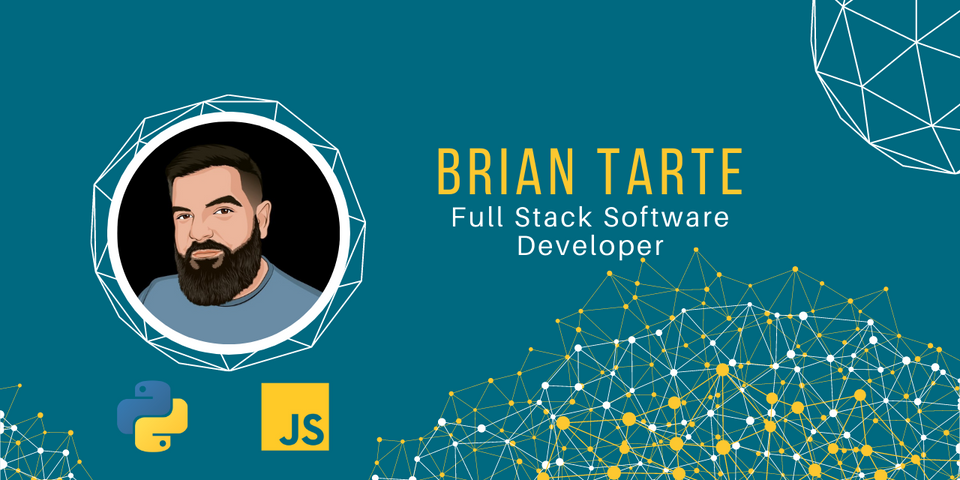

## 👨‍💻 My Developer Journey  
Growing up, I was always fascinated with computers and how they worked. I carried that curiosity into high school where I had my first real exposure to software development: HTML and C++. While it remained something I was intrigued by, I figured it wasn't a reasonable career aspiration at the time and began to focus on other areas of life.

I served in the United States Marine Corps after high school, and then completed my bachelor's and master's degrees after getting out. After stumbling my way into supply chain operations, I quickly began to fall in love with software development again because of my exposure to the various proprietary systems that were homegrown. However, I felt it was out of reach for me and not something I could pursue.

Fast-forward almost 12 years into my career, having dabbled in a self-taught approach (that didn't pan out),  and some random courses at the local community college, I decided to get serious about my burning desire to become a dev. 

Enter Code Fellows, a school offering an accelerated software development program that provided me with a newfound skillset. Through Code Fellows, I graduated with a certificate in Advanced Software Development, with a focus on Python.  

As I navigated the waters of learning software development, I came to realize that my "home" is in coding, be it development, security, or data analytics. Even when my role didn't directly call for it, I've found a way to integrate coding; whether it be a simple application to help with tracking returns and re-capturing nearly $160k in revenue or building out a comprehensive dashboard to assist the C-suite in making well-informed decisions to drive revenue generation. I've always found a way.
  

   

- 📫 How to reach me: brianjtarte@gmail.com
- ⚡ Two Truths and a Lie: 
  1. I participated in a polar bear plunge off the coast of Iceland
  2. I fell off a jet and lived to tell the tale
  3. I once rode in a Tesla with Bill Nye the Science Guy

  
  

   

## My Skill Set  
<table><tr><td valign="top" width="33%">

### Frontend  

  
  
  
  
  
  
  
  
  

</td><td valign="top" width="33%">

### Backend  

  
  
  
  
  
  
  
  

</td><td valign="top" width="33%">

### DevOps  

  
  
  
  
  

</td></tr></table>  

   

## Connect with me  

  

  
  

   

## Github Stats  

  
 

   

  

   

            

 

----

Generated using <a href="https://profilinator.rishav.dev/" target="_blank">Github Profilinator</a>

